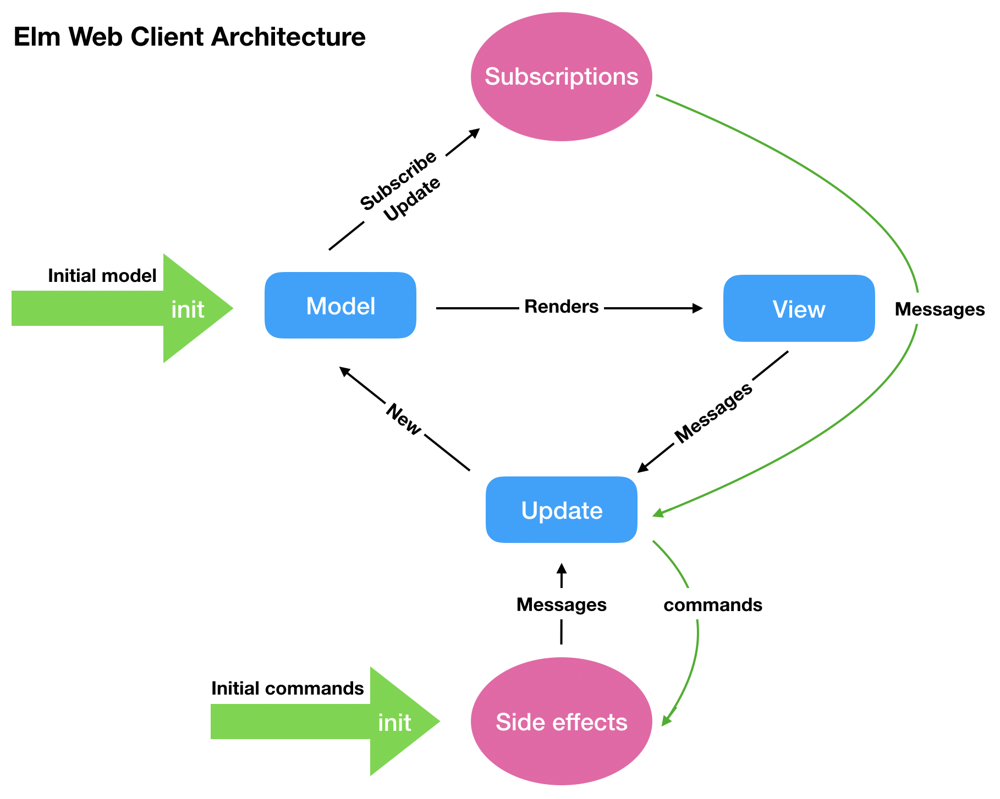

# elm-web-client
An Elm web client to demonstrate use cases of user generated cryptographic tokens.

Live instance: [demo.dignity.network](http://demo.dignity.network/)

Works best on mobile
# Dependencies
- Docker

# Technologies
- Elmlang
- Nodejs
- Webpack

# Build
```bash
$ export BACKEND_ADDRESS=http://10.20.30.2:1234
$ export APP_ENV=dev
$ docker build -t elm-web-client --build-arg BACKEND_ADDRESS --build-arg APP_ENV .
```

# Run development mode
To run application with live reloading and hot module replacement. First build an image with APP_ENV=dev (see above). Run the following command
```bash 
$ docker run -d -p 8888 elm-web-client
```

# Run using docker-compose
Make sure to configure your backend service

```yml
version: "3"

services:
    backend_service:
        ....
    elm-client:
        build:
        context: ./path/to/folder
        depends_on:
        - backend_service
        ports:
        - "8888:8888"
        volumes:
        - ./path/to/folder:/app/src
        environment:
        BACKEND_ADDRESS: "http://backend_service:3000"
        APP_ENV: dev
```

# Build and run on production
```bash
# Build an image for production
$ export BACKEND_ADDRESS=http://10.20.30.2:1234
$ export APP_ENV=production
$ docker build -t elm-web-client --build-arg BACKEND_ADDRESS --build-arg APP_ENV .
# Run a container of that image
$ docker run -d -p 80 elm-web-client

# In the case of docker-compose. Configure APP_ENV as production 
$ docker-compose up elm-client
```

# Archeticture


# Acknowledgements
- Khaled Jouda (github [@kjda](https://github.com/kjda))
- Dirk Helbing (twitter [@dirkhelbing](https://twitter.com/DirkHelbing))